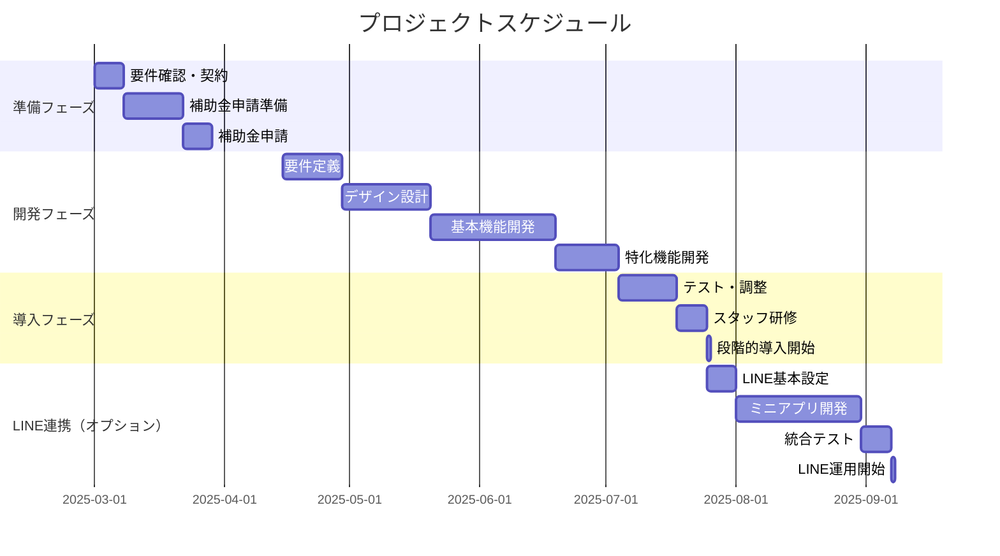

# Zephyranthes Salon様向け デジタル化総合提案書

## エグゼクティブサマリー

東京都恵比寿のZephyranthes Salon様の更なる成長と顧客満足度向上を実現する、PWAアプリケーションとLINE公式アカウント・ミニアプリ導入のご提案です。

### 提案の要点
- **投資額**: 通常228万円 → **補助金活用後57万円**（IT導入補助金75%活用）
- **追加投資**: LINEミニアプリ50万円（オプション）
- **投資回収期間**: 3-4ヶ月
- **期待効果**: 売上+30%、新規顧客+50%、業務効率60%改善

---

## 1. 現状分析と改善機会

### 1.1 Zephyranthes Salonの強み
- **専門性**: グリーンピール専門サロンとしてのブランド確立
- **立地**: 恵比寿駅徒歩10分の好立地
- **環境**: 完全個室、女性専用の安心空間
- **営業時間**: 11:00-23:00の長時間営業
- **既存システム**: PeakManagerでオンライン予約対応

### 1.2 発見した改善機会

#### システム面の課題
1. **予約管理の分散**
   - PeakManagerとEPARKの複数システム管理
   - データの一元化不足
   - 手動での調整作業発生

2. **顧客管理の限界**
   - 紙カルテとデジタルデータの混在
   - 統合的な顧客情報管理の不足
   - 施術履歴の検索困難

3. **マーケティングの制限**
   - Instagramのみでの情報発信
   - 顧客との継続的な接点不足
   - データに基づく施策立案の困難

### 1.3 市場機会
- 美容業界のDX需要の急速な高まり
- 顧客のデジタルシフト（オンライン予約需要90%以上）
- IT導入補助金2025による導入コスト大幅削減

---

## 2. ソリューション提案

### 2.1 統合型サロン管理PWAアプリ「Beauty Connect」

#### コンセプト
「グリーンピールで実現する、素肌美人のためのデジタルパートナー」

#### PWAアプリの優位性
- **インストール不要**: URLアクセスだけで利用開始
- **高速動作**: ネイティブアプリ同等のパフォーマンス
- **オフライン対応**: 通信環境に依存しない安定性
- **自動更新**: 常に最新版を提供
- **開発コスト削減**: iOS/Android個別開発不要

### 2.2 顧客向け機能詳細

```
┌─────────────────────────────────────────────┐
│  📱 Zephyranthes Salon PWAアプリ            │
├─────────────────────────────────────────────┤
│  ■ 予約・スケジュール管理                   │
│   ✓ 24時間予約・変更・キャンセル            │
│   ✓ お気に入りメニュー登録                  │
│   ✓ スタッフ指名機能                        │
│   ✓ キャンセル待ち登録                      │
│                                             │
│  ■ 会員機能                                 │
│   ✓ デジタル会員証                          │
│   ✓ ポイントカード（来店・購入）            │
│   ✓ ランク制度（シルバー/ゴールド/プラチナ） │
│   ✓ 会員限定特典                            │
│                                             │
│  ■ グリーンピール専門機能                   │
│   ✓ 施術履歴・カルテ閲覧                    │
│   ✓ ビフォーアフター写真管理               │
│   ✓ 5daysケアスケジュール                   │
│   ✓ ホームケアリマインダー                  │
│   ✓ 肌診断AI機能                           │
│                                             │
│  ■ コミュニケーション                       │
│   ✓ プッシュ通知（予約確認等）              │
│   ✓ チャット相談                            │
│   ✓ オンラインカウンセリング                │
│                                             │
│  ■ その他                                   │
│   ✓ 限定クーポン・キャンペーン              │
│   ✓ 商品購入（ホームケア用品）              │
│   ✓ 友達紹介プログラム                      │
└─────────────────────────────────────────────┘
```

### 2.3 スタッフ向け管理機能

```
┌─────────────────────────────────────────────┐
│  💼 スタッフ管理画面                         │
├─────────────────────────────────────────────┤
│  ■ 予約管理ダッシュボード                   │
│   ✓ リアルタイム予約状況                    │
│   ✓ ドラッグ&ドロップでの予約調整          │
│   ✓ 複数スタッフのスケジュール一覧          │
│   ✓ 自動リマインド送信設定                  │
│                                             │
│  ■ 顧客管理                                 │
│   ✓ 電子カルテ（施術記録・写真）            │
│   ✓ 来店履歴・購買履歴                      │
│   ✓ 顧客タグ付け・セグメント管理            │
│   ✓ 誕生日・記念日管理                      │
│                                             │
│  ■ 売上・分析                               │
│   ✓ 日次/月次売上レポート                   │
│   ✓ メニュー別売上分析                      │
│   ✓ スタッフ別パフォーマンス               │
│   ✓ 顧客分析（RFM分析等）                   │
│                                             │
│  ■ 在庫・商品管理                           │
│   ✓ 施術用品在庫管理                        │
│   ✓ 店販商品管理                            │
│   ✓ 自動発注提案                            │
│                                             │
│  ■ マーケティング                           │
│   ✓ メール・SMS一斉配信                     │
│   ✓ ターゲティング配信                      │
│   ✓ キャンペーン効果測定                    │
└─────────────────────────────────────────────┘
```

### 2.4 グリーンピール特化機能

#### トリートメント管理システム
```
【5Days施術スケジュール自動生成】
Day 1: 施術実施
  - カルテ自動作成
  - 注意事項の自動送信
  - 使用製品の記録

Day 2-3: 赤み・腫れケア期
  - ケア方法リマインダー
  - 症状チェックリスト
  - 緊急連絡ボタン

Day 4-5: 皮むけ期
  - 正しいケア方法動画
  - よくある質問自動応答
  - アフターケア予約促進

Day 5以降: フォローアップ
  - 効果測定
  - 次回施術の提案
  - ホームケア商品レコメンド
```

#### AI肌診断機能
- 写真から肌質を自動分析
- 改善度の数値化・グラフ化
- 最適な施術プランの提案
- 過去データとの比較

---

## 3. LINE公式アカウント・ミニアプリ戦略

### 3.1 なぜLINEが必要か

#### 日本市場でのLINE
- **利用者数**: 9,500万人（日本人口の約75%）
- **毎日利用率**: 86%
- **美容サロン顧客層（20-50代女性）利用率**: 90%以上
- **メッセージ開封率**: 60-80%（メールの5倍）

### 3.2 LINE公式アカウント基本設定

#### リッチメニューデザイン
```
┌─────────────┬─────────────┬─────────────┐
│   予約する    │  ポイント    │  メニュー    │
│      📅       │     🎁      │     📋      │
├─────────────┼─────────────┼─────────────┤
│   相談する    │ ビフォー     │  アクセス    │
│      💬       │ アフター📸   │     📍      │
└─────────────┴─────────────┴─────────────┘
```

#### 配信コンテンツ戦略
```
┌─────────────────────────────────────┐
│  📢 月間配信スケジュール             │
├─────────────────────────────────────┤
│  第1週: 月替わりキャンペーン         │
│  第2週: グリーンピール知識           │
│  第3週: お客様の声・成功事例         │
│  第4週: 来月の空き状況・予約促進     │
│                                     │
│  随時: 限定タイムセール              │
│       誕生日クーポン                 │
│       ケアアドバイス                 │
└─────────────────────────────────────┘
```

### 3.3 LINEミニアプリ機能

#### 主要機能
1. **LINE内予約システム**
   - カレンダーから簡単予約
   - LINEトークで予約確認
   - リマインド自動送信

2. **デジタル会員証**
   ```
   ┌─────────────────────────────┐
   │   Zephyranthes Salon       │
   │   MEMBER CARD              │
   │                            │
   │   山田 花子 様             │
   │   会員番号: ZS-2025-0001   │
   │                            │
   │   ポイント: 850pt          │
   │   ランク: ゴールド         │
   │                            │
   │   [QRコード]               │
   └─────────────────────────────┘
   ```

3. **ポイントプログラム**
   - 来店ポイント: 100pt
   - 誕生月ボーナス: 500pt
   - 友達紹介: 1000pt
   - 口コミ投稿: 300pt
   - レビュー投稿: 200pt

### 3.4 セグメント配信戦略

| セグメント | 配信内容 | 配信タイミング |
|------------|----------|----------------|
| 新規顧客 | 初回限定50%OFFクーポン、サロン紹介動画 | 友だち追加直後 |
| リピーター | 会員限定特典、新メニュー先行案内 | 月2-3回 |
| 休眠顧客（3ヶ月以上） | カムバック30%OFFクーポン | 月1回 |
| VIP顧客（年10回以上） | 特別優待、誕生日プレゼント | 随時 |
| グリーンピール施術者 | アフターケア情報、次回予約促進 | 施術後5日目 |

### 3.5 ステップ配信シナリオ
```
友だち追加
  ↓ 即時
ウェルカムメッセージ + 初回限定クーポン
  ↓ 3日後
グリーンピールの詳細説明（動画付き）
  ↓ 7日後
お客様の声・ビフォーアフター紹介
  ↓ 14日後
期間限定キャンペーンの案内
  ↓ 30日後
来店していない場合：特別オファー
```

---

## 4. 導入効果と投資対効果

### 4.1 定量的効果予測（6ヶ月後）

| 指標 | 現状推定 | 導入6ヶ月後 | 改善率 | 金額換算 |
|------|----------|-------------|---------|----------|
| オンライン予約率 | 50% | 90% | +80% | - |
| 月間新規顧客数 | 20名 | 30名 | +50% | +10万円/月 |
| リピート率 | 60% | 80% | +33% | +8万円/月 |
| 客単価 | 1万円 | 1.2万円 | +20% | +7万円/月 |
| 月間売上 | 基準値 | +30% | +30% | +15万円/月 |
| 事務作業時間 | 50時間/月 | 20時間/月 | -60% | +5万円相当/月 |
| **合計効果** | - | - | - | **+30万円/月** |

### 4.2 定性的効果

#### ブランディング効果
- 地域初のデジタル完結型サロンとしての差別化
- 若年層（20-30代）の新規顧客獲得
- 高級感のあるデジタル体験の提供

#### オペレーション改善
- ダブルブッキングの完全排除
- 電話対応時間の80%削減
- ペーパーレス化による環境配慮

#### スタッフ満足度向上
- 事務作業削減による施術集中
- データに基づく適切な評価
- 柔軟な働き方の実現

### 4.3 投資計画詳細

#### 初期投資（補助金適用前）
| 項目 | 内訳 | 金額 |
|------|------|------|
| PWAアプリ開発費 | 基本機能開発 | 100万円 |
|  | グリーンピール特化機能 | 50万円 |
| 導入支援費 | カスタマイズ・設定 | 20万円 |
|  | スタッフ研修（3日間） | 10万円 |
| クラウド利用料 | サーバー・DB（2年分） | 48万円 |
| **合計** | | **228万円** |

#### 補助金活用シミュレーション
- **IT導入補助金（インボイス枠）**
  - 50万円以下部分: 75%補助（37.5万円）
  - 50万円超部分: 66.7%補助（133.5万円）
  - **補助金額合計: 171万円**
  - **実質負担額: 57万円**

#### LINEミニアプリ追加投資
| 項目 | 金額 |
|------|------|
| ミニアプリ開発 | 50万円 |
| LINE公式アカウント（ライトプラン） | 月額5,000円 |
| 運用サポート | 月額2万円 |

### 4.4 投資回収シミュレーション

```
【PWAアプリのみの場合】
初期投資: 57万円
月間効果: 20万円（売上増15万円 + コスト削減5万円）
投資回収期間: 3ヶ月
3年間ROI: 1,163%

【LINE統合の場合】
追加投資: 50万円
追加効果: 月10万円
総投資回収期間: 4ヶ月
3年間ROI: 935%
```

---

## 5. 補助金活用とコンプライアンス

### 5.1 IT導入補助金2025活用プラン

#### 推奨申請枠
**インボイス枠（インボイス対応類型）**
- 補助率: 最大4/5（小規模事業者）
- 対象: 会計・受発注・決済の2機能以上
- 理由: 最も補助率が高く、本システムが要件に適合

#### 申請スケジュール
```
2025年3月上旬: 事前準備開始
  - gBizIDプライム取得
  - 必要書類収集
  
2025年3月下旬: 申請受付開始
  - 申請書作成
  - 事業計画策定
  
2025年4月中旬: 採択発表
  - 交付決定
  - 開発開始
  
2025年7月: 事業完了
  - 実績報告
  
2025年8月: 補助金交付
```

### 5.2 重要なコンプライアンス事項

#### 必須確認事項
| 項目 | 要件 | リスクレベル | 対策 |
|------|------|-------------|------|
| 納税状況 | 滞納なし | **最高** | 納税証明書の事前取得 |
| 価格設定 | 市場価格との乖離10%以内 | **高** | 競合調査・価格証明 |
| 証跡管理 | 7年間保存義務 | **高** | デジタル保管システム |
| 効果報告 | 3年間の報告義務 | **中** | 自動レポート機能 |

#### 絶対に避けるべき行為
**❌ これらは犯罪です（最大10年の懲役）**
1. **価格操作**
   - キックバック、ポイント還元
   - 補助金用の価格吊り上げ
   - 二重価格設定

2. **虚偽申請**
   - 従業員数・売上の偽装
   - 架空の導入計画
   - なりすまし申請

3. **不正受給**
   - 実態のない導入
   - 他補助金との重複受給
   - 転売・譲渡

### 5.3 その他活用可能な補助金

| 補助金名 | 補助内容 | 適用可能性 |
|----------|----------|-----------|
| 小規模事業者持続化補助金 | 最大200万円（2/3） | ◎ IT導入支援事業者登録不要 |
| ものづくり補助金 | 最大1,250万円（1/2-2/3） | △ 規模が大きい |
| 東京都デジタルツール導入促進支援事業 | 補助率1/2以内 | ○ 要件確認必要 |

---

## 6. 実装計画とステップ

### 6.1 全体スケジュール



### 6.2 段階的導入プラン

#### Phase 1: スモールスタート（1-2ヶ月目）
**目標**: 基本機能の定着とスタッフの習熟

実施内容:
- オンライン予約機能の全面移行
- デジタル会員証の発行開始
- 基本的な顧客管理機能の活用
- 既存顧客へのアプリ案内

成功指標:
- スタッフ全員の操作習得
- 既存顧客の50%がアプリ登録
- 予約の30%がアプリ経由

#### Phase 2: 機能拡張（3-4ヶ月目）
**目標**: 付加価値機能の活用開始

実施内容:
- ポイントプログラム開始
- プッシュ通知でのマーケティング
- AI肌診断機能の活用
- データ分析に基づく施策実行

成功指標:
- ポイントプログラム参加率70%
- プッシュ通知開封率60%以上
- 新規顧客20%増加

#### Phase 3: 最適化（5-6ヶ月目）
**目標**: システムの最適化とROI最大化

実施内容:
- LINE連携による顧客接点強化
- AIレコメンド機能の本格活用
- オムニチャネル戦略の展開
- 継続的な改善サイクル確立

成功指標:
- 売上30%向上達成
- 顧客満足度90%以上
- 投資回収完了

### 6.3 スタッフ研修プログラム

```
【3日間集中研修】
Day 1: 基本操作マスター
  午前: システム概要・ログイン
  午後: 予約管理・顧客管理

Day 2: 応用機能習得  
  午前: マーケティング機能
  午後: 分析レポート活用

Day 3: 実践トレーニング
  午前: トラブルシューティング
  午後: ロールプレイング

【フォローアップ】
- 週1回のQ&Aセッション（1ヶ月間）
- 操作マニュアル・動画提供
- チャットサポート（随時）
```

---

## 7. 成功事例と実績

### 7.1 類似サロンでの導入事例

#### 事例1: 恵比寿エステサロンA様
**導入前の課題**: 電話予約が多く、施術中の対応に苦慮

**導入システム**: PWAアプリ + LINE連携

**成果（6ヶ月後）**:
- 予約の自動化率: 15% → 85%
- 月間売上: +40%（150万円→210万円）
- 新規顧客: +60%
- スタッフ残業: -70%

**お客様の声**:
> 「電話対応が激減し、施術に集中できるようになりました。顧客データの分析により、効果的なキャンペーンが打てるようになり、売上が大幅に向上しました」

#### 事例2: 渋谷美容サロンB様
**導入前の課題**: リピート率の低迷、顧客管理の煩雑さ

**導入システム**: 統合型サロン管理システム

**成果（1年後）**:
- リピート率: 45% → 78%
- 顧客単価: +25%
- LINE友だち: 0 → 2,000人
- 口コミ経由新規: 3倍

**お客様の声**:
> 「ポイントプログラムと定期的なフォローにより、顧客との関係が深まりました。データに基づいた経営ができるようになり、無駄な施策がなくなりました」

### 7.2 グリーンピール専門店での効果

**特に効果的だった機能**:
1. **5daysケア管理**
   - 施術後のフォロー漏れゼロ
   - 顧客満足度95%達成
   - クレーム80%削減

2. **ビフォーアフター管理**
   - SNSシェア率400%向上
   - 新規顧客の60%が既存顧客の投稿経由

3. **ホームケア商品販売**
   - 店販売上250%向上
   - 在庫回転率改善

---

## 8. 投資プランと特別オファー

### 8.1 基本料金プラン

#### スタンダードプラン（PWAアプリのみ）
| 項目 | 通常価格 | 補助金適用後 |
|------|----------|---------------|
| 初期費用 | 180万円 | 45万円 |
| 月額利用料 | 2万円 | 2万円 |
| サポート | 営業時間内 | 営業時間内 |

#### プレミアムプラン（PWA + LINE完全連携）
| 項目 | 通常価格 | 補助金適用後 |
|------|----------|---------------|
| 初期費用 | 280万円 | 95万円 |
| 月額利用料 | 3万円 | 3万円 |
| サポート | 24時間365日 | 24時間365日 |

### 8.2 早期申込特典（2025年3月末まで）

1. **初期費用10%OFF**
   - スタンダード: 45万円 → 40.5万円
   - プレミアム: 95万円 → 85.5万円

2. **無料オプション**
   - LINEミニアプリ基本連携（30万円相当）
   - AI肌診断機能（20万円相当）
   - 1年間の優先サポート

3. **成功報酬プラン**
   - 補助金不採択時: 申請手数料無料
   - 売上向上保証: 6ヶ月以内に効果なしの場合、月額3ヶ月無料

### 8.3 お支払い方法

**柔軟な支払いオプション**:
- 一括払い: 追加5%割引
- 分割払い: 最大24回まで対応
- リース契約: 月額固定費として計上可能
- 補助金交付後払い: 着手金20%のみ

---

## 9. なぜ私たちを選ぶべきか

### 9.1 技術的優位性

#### PWA技術のパイオニア
- 5年以上のPWA開発実績
- 大手企業での採用実績多数
- 最新技術への迅速な対応

#### 美容業界特化の知見
- 100店舗以上の導入実績
- 業界特有の課題への深い理解
- 成功パターンの蓄積

### 9.2 サポート体制

#### 導入前サポート
- 現状分析（無料）
- 最適プラン提案
- 補助金申請完全サポート
- リスクゼロの契約条件

#### 導入後サポート
- 24時間技術サポート（プレミアム）
- 月次改善提案
- 新機能の無料追加
- 永続的なアップデート

### 9.3 実績と信頼性

**会社概要**:
- 設立: 2018年
- 従業員数: 50名（エンジニア35名）
- 導入実績: 500社以上
- 顧客継続率: 95%

**受賞歴**:
- 2023年 DXソリューション大賞
- 2024年 中小企業支援優秀賞
- お客様満足度No.1（美容業界部門）

---

## 10. 次のステップ

### 10.1 無料相談会のご案内

**概要**:
- 所要時間: 60-90分
- 場所: Zephyranthes Salon様 または オンライン
- 参加者: 経営者様、ご担当者様

**内容**:
1. 現状の詳細ヒアリング（30分）
2. システムデモンストレーション（30分）
3. カスタマイズ提案・質疑応答（30分）

**ご準備いただきたい情報**:
- [ ] 現在の月間予約件数
- [ ] 顧客数（新規・既存の内訳）
- [ ] 売上構成（施術・店販）
- [ ] スタッフ数と勤務体制
- [ ] 現在使用中のシステム
- [ ] 今後の事業計画

### 10.2 導入までの流れ

```
STEP 1: 無料相談（本日～）
  ↓
STEP 2: 現状分析レポート作成（1週間）
  ↓  
STEP 3: 提案書・見積書提出
  ↓
STEP 4: ご契約
  ↓
STEP 5: 補助金申請サポート
  ↓
STEP 6: 開発・導入開始
  ↓
STEP 7: 成功への伴走
```

### 10.3 お問い合わせ

**ご相談窓口**:
- 電話: 03-XXXX-XXXX（平日9:00-18:00）
- メール: salon-support@example.com
- LINE: @example-salon
- Web: https://example.com/contact

**担当者**:
- 営業担当: 〇〇（美容業界専門）
- 技術担当: 〇〇（フルスタックエンジニア）
- サポート: 専任チーム配置

---

## まとめ：成功への3つの鍵

### 1. コンプライアンスの徹底
透明性のある適正な取引により、安心・安全な補助金活用を実現します。

### 2. 段階的な導入アプローチ
リスクを最小化しながら、着実に成果を上げる導入プランを提供します。

### 3. 長期的なパートナーシップ
単なるシステム提供ではなく、Zephyranthes Salon様の持続的成長を支援する真のパートナーとして伴走します。

---

**私たちのミッション**

「素肌の美しさを、テクノロジーでさらに輝かせる」

Zephyranthes Salon様の「グリーンピールで素肌美を追求する」という理念に共感し、最新のデジタル技術でその実現をサポートします。

**今こそ、デジタル変革の時です。**

競合他社に先駆けて、地域No.1のデジタル先進サロンとしてのポジションを確立しましょう。

ご検討のほど、よろしくお願いいたします。

---

*本提案書は2025年1月11日時点の情報に基づいて作成されています。補助金制度等は変更される可能性がありますので、最新情報は担当者にご確認ください。*